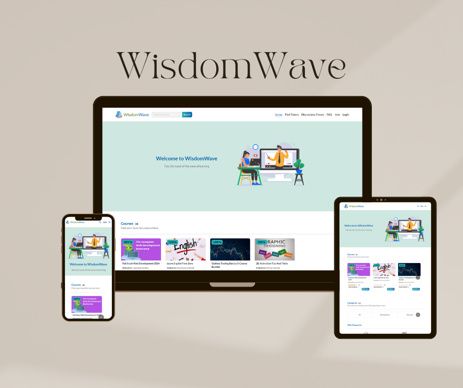

<h2 align="center">Hi, I am Joujoniki Asa Roy</h2>
<h3 align="center">Passionate about crafting engaging user experiences</h3>

 ## About Me 📄

I am Joujoniki Asa Roy. Currently i am studying at Daffodil International University. My journey over the past year has been dedicated to enhanching the skills of  FRONT-END DEVELOPMENT. I've immersed myself in the world of web technologies, focus on React.js and the utility-first CSS framework Tailwind CSS also at Express.js and MongoDB, 

 

## Get in Touch	:link:

&nbsp;&nbsp;

## What I do 🌐

- Designing interactive and user-centric interfaces leveraging the power of React.
- Developing RESTful APIs using Node.js and Express for robust and scalable backend solutions.
- Incorporating MongoDB, managed through Mongoose, to facilitate efficient database management.
- Ensuring a smooth end-to-end user experience

## Current Overview :eye_speech_bubble:

🔭 I’m learning - at Programming Hero.  
🌱 I’m exploring -  React framework .   
👯 I’m looking - To collaborate on open source projects.    
🤔 I’m trying - To help people learn web development.  

## Technologies that I know :computer: 

 

 

## Profile Summery :scroll:

### Current Stat

  
 
 
 

## Projects :sparkles:

 
 ### 1. WisdomWave ( An e-learning and tutor finding website) 
**Preview:**     
**Live link:**  <a href="https://wisdomwave-project.netlify.app/">WisdomWave</a> 	:link:

**Repository Link:**  

Client Side: <a href="https://github.com/JoujonikiAsa2/wisdomwave-client-side">Click Here</a> :link:   
Server Side: <a href="https://github.com/JoujonikiAsa2/wisdomwave-server-side">Click Here</a> 	:link:

#### Top Features of This Project:
:heavy_check_mark: Buy Course: It helps student to buy course and learn.    
:heavy_check_mark: Find Tutor: It helps student to find tutor based on their profile.    
:heavy_check_mark:  Create Course: It helps instructor to create and manage course.   
:heavy_check_mark:  Create profile: It helps tutor to create profile.   
:heavy_check_mark:  Management: It helps admin to manage all users and activities.   

#### Technologies Used

- **Frontend:** HTML5, CSS3, JavaScript, React.js, Tailwind CSS frameworks 
- **Backend:** Node.js, Express.js, Mongoose
- **Authentication:** Firebase, JSON Web Tokens (JWT) for session management
- **Payment Integration:** sslcommerz

### 3. Study Together ( A assignment sharing website) 

**Live link:**  <a href="https://symphonious-kangaroo-78a9ea.netlify.app">Study Together</a> 	:link:

**Repository Link:**  

Client Side: <a href="https://github.com/Porgramming-Hero-web-course/b8a11-client-side-JoujonikiAsa2">Click Here</a>	:link:  
Server Side: <a href="https://github.com/Porgramming-Hero-web-course/b8a11-server-side-JoujonikiAsa2">Click Here</a> 	:link:

#### Top Features of This Project:
:heavy_check_mark: Create assignment: It helps user to create assignment.  
:heavy_check_mark: Update Assignment: User who created the assignment can update the assignent.   
:heavy_check_mark: Delete Assignment: User who created the assignment can delete the assignent.   
:heavy_check_mark: Give marks: Any user can give marks to other's assignment.   

#### Technologies Used

- **Frontend:** HTML5, CSS3, JavaScript, React.js, Tailwind CSS frameworks   
- **Backend:** Node.js Express.js MongoDB   

